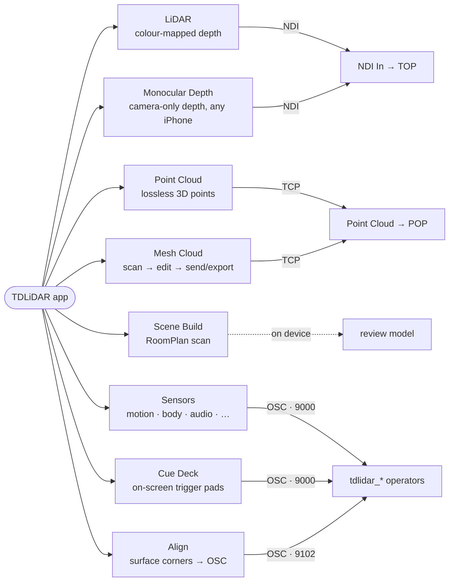

# App Guide

The TDLiDAR iPhone app is the data source. It captures the phone's sensors and streams them to your computer over the local network, where TouchDesigner (or any other receiver) picks them up. This section documents the app's UI and modes.

If you just want addresses and units, jump to the OSC Reference. If you want to wire operators, see the Operators pages. This section is about driving the phone.

## The eight modes

The app does eight different jobs, and you pick which one with the mode switcher. Each produces a different kind of output and travels over a different transport (or its own dedicated port), so each gets its own page:

- **LiDAR** — the original depth-streaming mode. Colour-mapped depth, and optionally the RGB camera, sent as an NDI video stream. See [LiDAR Mode]({{ '/lidar-mode.html' | relative_url }}).
- **Monocular Depth** — camera-only depth estimation, no LiDAR needed, on any iPhone camera. See [Monocular Depth Mode]({{ '/monocular-depth-mode.html' | relative_url }}).
- **Point Cloud** — a live, lossless 3D point cloud sent over TCP. See [Point Cloud Mode]({{ '/point-cloud-mode.html' | relative_url }}).
- **Mesh Cloud** — scan a space with the LiDAR mesh, walk the cleaned-up result, then send it to TD or export a PLY. See [Mesh Cloud Mode]({{ '/mesh-cloud-mode.html' | relative_url }}).
- **Scene Build** — Apple's RoomPlan room scanner. See [Scene Build Mode]({{ '/scene-build-mode.html' | relative_url }}).
- **Sensors** — dozens of individual sensors (motion, body, face, audio, touch and more) streamed as OSC. This is what feeds most of the operator family. See [Sensors Mode]({{ '/sensors-mode.html' | relative_url }}).
- **Cue Deck** — a bank of on-screen OSC trigger pads for manual cues. See [Cue Deck Mode]({{ '/cue-deck-mode.html' | relative_url }}).
- **Align** — tap a real surface to stream its corners for a TD projection-mapping warp network. See [Align Mode]({{ '/align-mode.html' | relative_url }}).

## The shared interface

A few controls appear no matter which mode you're in.

The **mode switcher** sits at the top. It collapses to a single blue arrow to stay out of the way; tap it to expand the list of modes — LiDAR, Monocular Depth, Point Cloud, Mesh Cloud, Scene Build, Sensors, Cue Deck and Align — and tap a mode to switch.

The **Settings gear** opens the settings sheet for the current mode. The settings are mode-aware: in LiDAR you get depth and NDI controls, in Sensors you get the sensor list and per-sensor tuning, etc.

In LiDAR and Monocular Depth modes a small **frame-rate pill** shows the actual frames per second the phone is achieving. It is more than a readout — tapping it opens Settings, and its number is a quick health check (if it drops below 30 fps, you may have too many sensors or a busy Wi-Fi).

Most modes also have a **slide-up dock** at the bottom (a compact chevron) that reveals the mode's primary controls without leaving the live view.

## Connecting

Connection is the same idea in every mode — same network, point the app at your computer — but the transport differs. Because it is the single most common source of trouble, it has its own page.

## Where to go next

- [Connecting]({{ '/connecting.html' | relative_url }}) — network setup, ports, discovery, wired mode, troubleshooting.
- [LiDAR Mode]({{ '/lidar-mode.html' | relative_url }}) — every depth, tone, colour and NDI control.
- [Monocular Depth Mode]({{ '/monocular-depth-mode.html' | relative_url }}) — camera-only depth, the Small/Medium/High depth models, auto-adjust.
- [Point Cloud Mode]({{ '/point-cloud-mode.html' | relative_url }}) — TCP streaming, the viewer, PLY export.
- [Mesh Cloud Mode]({{ '/mesh-cloud-mode.html' | relative_url }}) — scan, free-fly review, edit, send/export.
- [Scene Build Mode]({{ '/scene-build-mode.html' | relative_url }}) — scanning a room with RoomPlan.
- [Sensors Mode]({{ '/sensors-mode.html' | relative_url }}) — enabling sensors and per-sensor tuning.
- [Cue Deck Mode]({{ '/cue-deck-mode.html' | relative_url }}) — editable on-screen OSC trigger pads.
- [Align Mode]({{ '/align-mode.html' | relative_url }}) — surface-corner capture for projection mapping.
- [Show Control]({{ '/show-control-mode.html' | relative_url }}) — not a mode, runs independent of one: lets a lighting desk, QLab, MIDI or Companion drive the app remotely over OSC/MIDI.
- [Performance & Pro]({{ '/performance-pro.html' | relative_url }}) — Supercharge, background, Pro features, recording.
