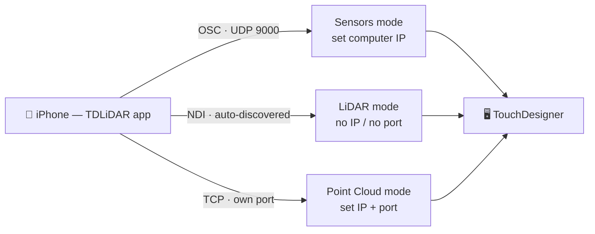

# Connecting

Every mode sends data to your computer over the local network. The single rule that fixes most problems: the phone and the computer must be on the **same** Wi-Fi or LAN, and that network must not isolate clients from each other. Guest networks, hotel and conference Wi-Fi, and routers with "client isolation" or "AP isolation" turned on will silently block the stream even though both devices show full bars. A normal home or studio network, or a direct connection, works.

## Three transports

The app uses a different transport for each kind of output, and you only deal with the one your mode uses.

OSC carries the individual sensors in Sensors mode. It is a stream of small messages over UDP to port 9000. You tell the app your computer's IP address; the port is fixed at 9000.

NDI carries the depth video and RGB camera in LiDAR mode. NDI announces itself on the network and is discovered automatically, so there is no IP or port to set — your TouchDesigner NDI In operator simply lists the phone as an available source by name.

TCP carries the point cloud in Point Cloud mode. It is a direct connection to your computer on its own port, chosen for lossless, exact 3D data. You set the computer's IP and the port in that mode's settings.

## Finding your computer

For the OSC and TCP transports you need your computer's IP address. The app includes automatic discovery: it browses the network for Mac and PC hosts that are running NDI Tools or TouchDesigner and lists them, so in most cases you pick your machine from a dropdown by name instead of typing anything. Discovery scores hosts and floats the most likely computer to the top.

If discovery comes up empty — some networks block the underlying Bonjour browse — type the IP by hand. You find it in your computer's network settings, and TouchDesigner reports it as well. It usually looks like a four-part number on your local subnet.

## NDI wired mode

For the lowest latency in LiDAR mode, tether the phone to the host with a USB cable, run NDI Tools on the host, and turn on **NDI Wired Mode** in the app. The NDI stream then travels over the cable instead of Wi-Fi, which removes wireless jitter. Turn it back off to return to wireless.

## Matching the receiver

On the TouchDesigner side, the operators in the family listen on OSC port 9000 by default, which matches the app. If you ever change the port in the app, change the **OSC Port** parameter on each operator to match. The point cloud operator listens on its own TCP port; match it to the app. The NDI operator picks the phone from a source dropdown — no port involved.

## When nothing arrives

Walk this list in order. Confirm both devices are on the same, non-isolated network. Confirm the app is targeting your computer's correct IP. Confirm the port matches — 9000 for OSC sensors, the shown port for the point cloud, automatic for NDI. Confirm the stream is actually started in the app and, for Sensors mode, that the specific sensor is enabled. Check that your computer's firewall allows TouchDesigner to receive incoming connections; on a fresh machine this is the usual culprit. Finally, remember that text-based sensors — speech, OCR, sound labels, NFC and QR payloads — arrive as OSC strings and must be read with an OSC-In DAT, not a CHOP, so if you see numbers flowing but no text that is why.
