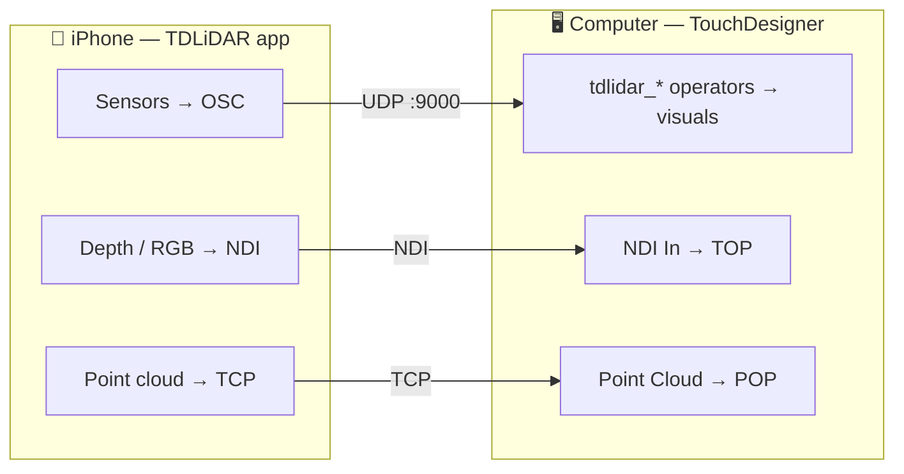

  
  <h1 class="td-hero-title">TDLiDAR</h1>
  
Turn an iPhone into ~40 live sensors inside TouchDesigner — with one drag-and-drop.

  

    
  

  

[Install](){: .btn .btn-primary .mr-2 }
[App Guide](){: .btn .mr-2 }
[Operators](){: .btn .mr-2 }
[FAQ](){: .btn }
{: .text-center }

TDLiDAR is an iOS app **plus** a TouchDesigner **operator family**. The app streams everything a modern iPhone can sense — motion, LiDAR depth, body/hand/face tracking, audio, camera vision, touch, and more — over your local network. The operators plug straight into your patch.

No networking knowledge required. No Python. Drop an op, point the phone, make visuals move.

---

## How it works

- **Most sensors** travel as **OSC** (small numeric messages) on **UDP port 9000**.
- **Video** (depth visuals, camera) travels as **NDI**.
- **The point cloud** travels as **TCP** (lossless 50k XYZ+RGB).

The phone and the computer just need to be on the **same network**.

> New here? Start with **[Install]()**, then skim the **[App Guide]()**. Stuck on "no data"? Jump to the **[FAQ]()**.
{: .note }

---

## Install (5 minutes)

1. **Get the app** — install **TDLiDAR** from the [App Store](https://apps.apple.com/us/app/tdlidar/id6760954732) on an iPhone (LiDAR Pro models unlock the depth/scan sensors; everything else works on any recent iPhone).
2. **Get the family** — drag **`TDLiDAR_family.tox`** into any TouchDesigner project. The operators appear in the **TAB / OP Create** menu under the **TDLiDAR** family (blue). See [Install]().
3. **Connect** — on the phone, open TDLiDAR, set the OSC target to your computer's IP, start streaming. (The app shows your IP + port.)
4. **Drop an op** — TAB → TDLiDAR → e.g. **Attitude**. It listens on 9000 and its tile shows live data.

That's it. If the tile shows moving numbers, you're connected.

---

## Your first patch

The fastest "wow":

1. TAB → TDLiDAR → **[QuaternionEuler]()** (phone tilt as pitch/roll/yaw).
2. Add a **Geometry COMP** + a **Box SOP**.
3. On the Geo's **Xform** page, drag the op's `pitch`/`roll`/`yaw` channels onto **Rotate x/y/z** (right‑click → Export CHOP). Multiply radians→degrees with a **Math CHOP** (×57.2957).
4. Tilt the phone → the box rotates in real space.

Swap it for **[Pinch]()** (air‑fader), **[Audio]()** (beat‑reactive), or **[Body]()** (a puppet skeleton) and the same five steps drive anything.

---

## The operators

Every operator has its own page in the [Operators section](). They share one rule: drop it, it listens on **OSC Port 9000**, and the tile previews its live output.

**Motion** — [Acceleration]() · [Gravity]() · [Gyro]() · [QuaternionEuler]() · [Magnetometer]() · [Barometer]() · [Activity]()

**Device** — [Battery]() · [Thermal State]() · [Low Power]() · [Screen Brightness]()

**Body & Vision** — [Body]() · [Hand]() · [Pinch]() · [Gesture]() · [Face]() · [AR Body]() · [Device Pose]()

**Scene & Detect** — [Camera Exposure]() · [Ambient Light]() · [AR Planes]() · [AR Mesh]() · [QR / Barcode]() · [Rectangle Detect]() · [Text (OCR)]() · [Saliency]() · [Front Distance]() · [Back Distance]() · [Animal]() · [Scene Room]()

**Audio** — [Mic Level]() · [Audio]() · [Speech]() · [Sound ID]()

**Touch & Input** — [Touch]() · [Apple Pencil]() · [Proximity]() · [NFC]() · [Volume / Remote]()

**External** — [AirPods]() · [Apple Watch]()

**Output / Utility** — [NDI]() · [Point Cloud]() · [Scene Build]() · [Depth]() · [Rectangle]()

---

## App‑side setup

- **Port:** the app sends OSC to UDP **9000** by default. If you change it on the phone, change **OSC Port** on each op to match.
- **One sensor or many:** enable as many sensors as you want; they all multiplex onto the same port. Some camera sensors are mutually exclusive (you can't run two different camera engines at once).
- **Device support:** depth/scan/LiDAR ops need a Pro iPhone; Face needs TrueDepth; Apple Pencil needs an iPad; Apple Watch needs the companion Watch app. Each op page lists what it needs.

The full walkthrough — every mode and every setting — is in the **[App Guide]()**, including deep references for **[every LiDAR setting]()** and **[every Point Cloud control]()**.

---

## Troubleshooting — "no data"

The #1 issue with anything OSC. Walk this list:

1. **Same network?** Phone and computer on the *same* Wi‑Fi/LAN. Guest networks and "client isolation" block it.
2. **Right IP?** The app must target *this computer's* IP. The app shows it.
3. **Port match?** App port == op's **OSC Port** (default 9000).
4. **Sensor enabled + streaming?** The app must be actively streaming that sensor.
5. **Firewall?** macOS/Windows firewall can block inbound UDP — allow TouchDesigner.
6. **String sensors** (Speech, OCR, QR payload, NFC, Sound ID label) need an **OSC In DAT**, not a CHOP — if you see numbers but no text, that's why.
7. **Stale channels?** Body/Hand only update while a subject is in frame (`/detected`). Check the op's Gotchas.

> More answers in the **[FAQ]()**.
{: .tip }

---

## For advanced users

- **Wire format is open** — see the [OSC Reference]() and the plain-language [OSC Sensor Guide](). Every op is just an OSC In CHOP/DAT + a Select; nothing is locked. Build your own receivers against the same addresses (Max, PD, Blender, Unity, openFrameworks, a browser).
- **Smoothing:** Lag/Filter CHOP on noisy motion; the 1€ filter pattern for pose.
- **Triggers:** Trigger/Logic CHOP on momentary channels (Remote, NFC, Gesture, beat/onset).
- **Geometry:** Body/Hand/Animal output POPs you can instance geometry onto; 6DoF Pose drives a Camera COMP for projection mapping.
- **Coexistence:** consult the app's conflict rules — AR‑world sensors (Pose/Planes/Mesh/Ambient/Back Distance) share one session; Body pairs only with Hands; ARKit Body and the depth session don't mix.

---

## Reference docs

- [App Guide]() — every mode and setting, top to bottom.
- [LiDAR — Every Setting]() — the depth/tone/colour/NDI controls and how each changes the look.
- [Point Cloud — Effects & Settings]() — viewer, cleanup, streaming and PLY capture.
- [Operators]() — one page per operator.
- [OSC Reference]() — the complete OSC wire spec (every address, type, range, rate).
- [OSC Sensor Guide]() — plain-language tour of the wire format.
- [FAQ]() — quick answers, especially for "no data".

---

  Made by <a href="https://www.patreon.com/aristideslab" target="_blank" rel="noopener noreferrer">Aristides Lab</a> ·
  <a href="https://apps.apple.com/us/app/tdlidar/id6760954732" target="_blank" rel="noopener noreferrer">App Store</a> ·
  <a href="https://github.com/TDLiDAR/DOC" target="_blank" rel="noopener noreferrer">GitHub</a>

