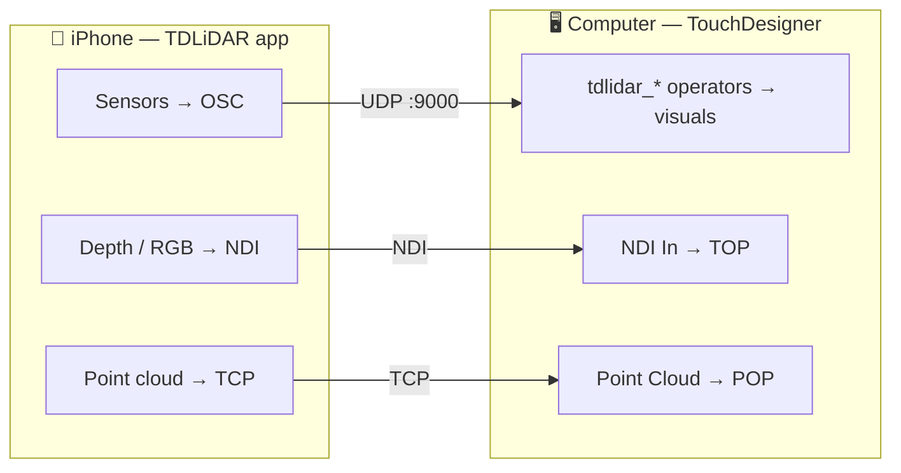

  
  <h1 class="td-hero-title">TDLiDAR</h1>
  
Turn an iPhone into ~40 live sensors inside TouchDesigner — with one drag-and-drop.

  

    
  

  

[Install]({{ '/install.html' | relative_url }}){: .btn .btn-primary .mr-2 }
[App Guide]({{ '/app-guide.html' | relative_url }}){: .btn .mr-2 }
[Operators]({{ '/operators.html' | relative_url }}){: .btn .mr-2 }
[FAQ]({{ '/faq.html' | relative_url }}){: .btn }
{: .text-center }

TDLiDAR is an iOS app **plus** a TouchDesigner **operator family**. The app streams everything a modern iPhone can sense — motion, LiDAR depth, body/hand/face tracking, audio, camera vision, touch, and more — over your local network. The operators plug straight into your patch.

No networking knowledge required. No Python. Drop an op, point the phone, make visuals move.

---

## How it works

- **Most sensors** travel as **OSC** (small numeric messages) on **UDP port 9000**.
- **Video** (depth visuals, camera) travels as **NDI**.
- **The point cloud** travels as **TCP** (lossless 50k XYZ+RGB).

The phone and the computer just need to be on the **same network**.

> New here? Start with **[Install]({{ '/install.html' | relative_url }})**, then skim the **[App Guide]({{ '/app-guide.html' | relative_url }})**. Stuck on "no data"? Jump to the **[FAQ]({{ '/faq.html' | relative_url }})**.
{: .note }

---

## Install (5 minutes)

1. **Get the app** — install **TDLiDAR** from the [App Store](https://apps.apple.com/us/app/tdlidar/id6760954732) on an iPhone (LiDAR Pro models unlock the depth/scan sensors; everything else works on any recent iPhone).
2. **Get the family** — drag **`TDLiDAR_family.tox`** into any TouchDesigner project. The operators appear in the **TAB / OP Create** menu under the **TDLiDAR** family (blue). See [Install]({{ '/install.html' | relative_url }}).
3. **Connect** — on the phone, open TDLiDAR, set the OSC target to your computer's IP, start streaming. (The app shows your IP + port.)
4. **Drop an op** — TAB → TDLiDAR → e.g. **Attitude**. It listens on 9000 and its tile shows live data.

That's it. If the tile shows moving numbers, you're connected.

---

## Your first patch

The fastest "wow":

1. TAB → TDLiDAR → **[QuaternionEuler]({{ '/tdlidar_attitude.html' | relative_url }})** (phone tilt as pitch/roll/yaw).
2. Add a **Geometry COMP** + a **Box SOP**.
3. On the Geo's **Xform** page, drag the op's `pitch`/`roll`/`yaw` channels onto **Rotate x/y/z** (right‑click → Export CHOP). Multiply radians→degrees with a **Math CHOP** (×57.2957).
4. Tilt the phone → the box rotates in real space.

Swap it for **[Pinch]({{ '/tdlidar_pinch.html' | relative_url }})** (air‑fader), **[Audio]({{ '/tdlidar_audio.html' | relative_url }})** (beat‑reactive), or **[Body]({{ '/tdlidar_body.html' | relative_url }})** (a puppet skeleton) and the same five steps drive anything.

---

## The operators

Every operator has its own page in the [Operators section]({{ '/operators.html' | relative_url }}). They share one rule: drop it, it listens on **OSC Port 9000**, and the tile previews its live output.

**Motion** — [Acceleration]({{ '/tdlidar_accel.html' | relative_url }}) · [Gravity]({{ '/tdlidar_gravity.html' | relative_url }}) · [Gyro]({{ '/tdlidar_gyro.html' | relative_url }}) · [QuaternionEuler]({{ '/tdlidar_attitude.html' | relative_url }}) · [Magnetometer]({{ '/tdlidar_magnetometer.html' | relative_url }}) · [Barometer]({{ '/tdlidar_barometer.html' | relative_url }}) · [Activity]({{ '/tdlidar_activity.html' | relative_url }})

**Device** — [Battery]({{ '/tdlidar_battery.html' | relative_url }}) · [Thermal State]({{ '/tdlidar_thermal.html' | relative_url }}) · [Low Power]({{ '/tdlidar_lowpower.html' | relative_url }}) · [Screen Brightness]({{ '/tdlidar_brightness.html' | relative_url }})

**Body & Vision** — [Body]({{ '/tdlidar_body.html' | relative_url }}) · [Hand]({{ '/tdlidar_hand.html' | relative_url }}) · [Pinch]({{ '/tdlidar_pinch.html' | relative_url }}) · [Gesture]({{ '/tdlidar_gesture.html' | relative_url }}) · [Face]({{ '/tdlidar_face.html' | relative_url }}) · [AR Body]({{ '/tdlidar_arbody.html' | relative_url }}) · [Device Pose]({{ '/tdlidar_devicepose.html' | relative_url }})

**Scene & Detect** — [Camera Exposure]({{ '/tdlidar_cam_exposure.html' | relative_url }}) · [Ambient Light]({{ '/tdlidar_ambient.html' | relative_url }}) · [AR Planes]({{ '/tdlidar_planes.html' | relative_url }}) · [AR Mesh]({{ '/tdlidar_armesh.html' | relative_url }}) · [QR / Barcode]({{ '/tdlidar_qr.html' | relative_url }}) · [Rectangle Detect]({{ '/tdlidar_rect_detect.html' | relative_url }}) · [Text (OCR)]({{ '/tdlidar_ocr.html' | relative_url }}) · [Saliency]({{ '/tdlidar_saliency.html' | relative_url }}) · [Front Distance]({{ '/tdlidar_frontdist.html' | relative_url }}) · [Back Distance]({{ '/tdlidar_backdist.html' | relative_url }}) · [Animal]({{ '/tdlidar_animal.html' | relative_url }}) · [Scene Room]({{ '/tdlidar_scene_room.html' | relative_url }})

**Audio** — [Mic Level]({{ '/tdlidar_mic_level.html' | relative_url }}) · [Audio]({{ '/tdlidar_audio.html' | relative_url }}) · [Speech]({{ '/tdlidar_speech.html' | relative_url }}) · [Sound ID]({{ '/tdlidar_sound.html' | relative_url }})

**Touch & Input** — [Touch]({{ '/tdlidar_touch.html' | relative_url }}) · [Apple Pencil]({{ '/tdlidar_pencil.html' | relative_url }}) · [Proximity]({{ '/tdlidar_proximity.html' | relative_url }}) · [NFC]({{ '/tdlidar_nfc.html' | relative_url }}) · [Volume / Remote]({{ '/tdlidar_remote.html' | relative_url }}) · [Cue]({{ '/tdlidar_cue.html' | relative_url }})

**External** — [AirPods]({{ '/tdlidar_airpods.html' | relative_url }}) · [Apple Watch]({{ '/tdlidar_watch.html' | relative_url }})

**Output / Utility** — [NDI]({{ '/tdlidar_ndi_in.html' | relative_url }}) · [Point Cloud]({{ '/tdlidar_pointcloud_tcp.html' | relative_url }}) · [Scene Build]({{ '/tdlidar_scene_room.html' | relative_url }}) · [Depth]({{ '/tdlidar_depth.html' | relative_url }}) · [Rectangle]({{ '/tdlidar_rectangle.html' | relative_url }}) · [Align]({{ '/tdlidar_align.html' | relative_url }})

---

## App‑side setup

- **Port:** the app sends OSC to UDP **9000** by default. If you change it on the phone, change **OSC Port** on each op to match.
- **One sensor or many:** enable as many sensors as you want; they all multiplex onto the same port. Some camera sensors are mutually exclusive (you can't run two different camera engines at once).
- **Device support:** depth/scan/LiDAR ops need a Pro iPhone; Face needs TrueDepth; Apple Pencil needs an iPad; Apple Watch needs the companion Watch app. Each op page lists what it needs.

The full walkthrough — every mode and every setting — is in the **[App Guide]({{ '/app-guide.html' | relative_url }})**, including deep references for **[every LiDAR setting]({{ '/lidar-settings.html' | relative_url }})** and **[every Point Cloud control]({{ '/point-cloud-settings.html' | relative_url }})**.

---

## Troubleshooting — "no data"

The #1 issue with anything OSC. Walk this list:

1. **Same network?** Phone and computer on the *same* Wi‑Fi/LAN. Guest networks and "client isolation" block it.
2. **Right IP?** The app must target *this computer's* IP. The app shows it.
3. **Port match?** App port == op's **OSC Port** (default 9000).
4. **Sensor enabled + streaming?** The app must be actively streaming that sensor.
5. **Firewall?** macOS/Windows firewall can block inbound UDP — allow TouchDesigner.
6. **String sensors** (Speech, OCR, QR payload, NFC, Sound ID label) need an **OSC In DAT**, not a CHOP — if you see numbers but no text, that's why.
7. **Stale channels?** Body/Hand only update while a subject is in frame (`/detected`). Check the op's Gotchas.

> More answers in the **[FAQ]({{ '/faq.html' | relative_url }})**.
{: .tip }

---

## For advanced users

- **Wire format is open** — see the [OSC Reference]({{ '/osc-reference.html' | relative_url }}) and the plain-language [OSC Sensor Guide]({{ '/osc-sensor-guide.html' | relative_url }}). Every op is just an OSC In CHOP/DAT + a Select; nothing is locked. Build your own receivers against the same addresses (Max, PD, Blender, Unity, openFrameworks, a browser).
- **Smoothing:** Lag/Filter CHOP on noisy motion; the 1€ filter pattern for pose.
- **Triggers:** Trigger/Logic CHOP on momentary channels (Remote, NFC, Gesture, beat/onset).
- **Geometry:** Body/Hand/Animal output POPs you can instance geometry onto; 6DoF Pose drives a Camera COMP for projection mapping.
- **Coexistence:** consult the app's conflict rules — AR‑world sensors (Pose/Planes/Mesh/Ambient/Back Distance) share one session; Body pairs only with Hands; ARKit Body and the depth session don't mix.

---

## Reference docs

- [App Guide]({{ '/app-guide.html' | relative_url }}) — every mode and setting, top to bottom.
- [LiDAR — Every Setting]({{ '/lidar-settings.html' | relative_url }}) — the depth/tone/colour/NDI controls and how each changes the look.
- [Point Cloud — Effects & Settings]({{ '/point-cloud-settings.html' | relative_url }}) — viewer, cleanup, streaming and PLY capture.
- [Operators]({{ '/operators.html' | relative_url }}) — one page per operator.
- [OSC Reference]({{ '/osc-reference.html' | relative_url }}) — the complete OSC wire spec (every address, type, range, rate).
- [OSC Sensor Guide]({{ '/osc-sensor-guide.html' | relative_url }}) — plain-language tour of the wire format.
- [FAQ]({{ '/faq.html' | relative_url }}) — quick answers, especially for "no data".

---

  Made by <a href="https://www.patreon.com/aristideslab" target="_blank" rel="noopener noreferrer">Aristides Lab</a> ·
  <a href="https://apps.apple.com/us/app/tdlidar/id6760954732" target="_blank" rel="noopener noreferrer">App Store</a> ·
  <a href="https://github.com/TDLiDAR/DOC" target="_blank" rel="noopener noreferrer">GitHub</a>

