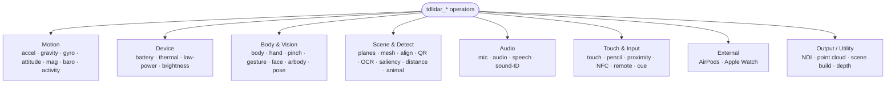

# Operators

The TDLiDAR family is forty-seven operators, one per sensor, tool or output. Drop any of them and it listens on OSC port 9000 (or its own transport/port for the video, point-cloud, Align and Cue Deck ops), previews its live output on the node tile, and connects only to sensible targets.

Each operator has its own detailed page under the Operators section with its OSC input, parameters, outputs, a beginner quick-start and advanced patterns. This page is the overview.

## Motion

Acceleration, Gravity, Gyro, Quaternion / Euler, Magnetometer, Barometer and Motion Activity. These are the phone's inertial and environmental sensors, mostly three-channel CHOP outputs. Acceleration and Gravity are the most useful — tilt + vibration in the smoothest six-channel form.

## Device

Battery, Thermal State, Low Power and Screen Brightness. Lightweight readings of the phone's own state. Thermal is a zero-to-three scale you can use to degrade your render before the phone throttles your script.

## Body and vision

Body and Hand reconstruct full skeletons from the back camera. Pinch is an expressive air-fader from the thumb-to-index distance, and Gesture reports open hand, fist, peace and point. Face delivers all ARKit blend shapes, head rotation and gaze direction.

## Scene and detection

Camera Exposure exposes ISO, shutter, white balance and focus as a light proxy. Ambient Light reads room brightness and colour temperature. AR Planes and AR Mesh report scan progress and geometry. Align is a projection-mapping assist — tap a real surface on the phone and its true 3D corners land on the wire, a starting geometry for a TD keystone/warp network. QR, Text, Saliency and Rectangle are live computer-vision detections. Back/Front Distance are the LiDAR and TrueDepth rangefinders. Animal is a four-leg keypoint tracker.

## Audio

Mic Level is a single volume reading. Audio is the full reactive suite — band levels, FFT spectrum, beat and onset, and pitch and timbre channels. Speech is on-device speech-to-text rendered as string updates. Sound ID is a 300+ class classifier.

## Touch and input

Touch turns the phone screen into an XY pad with pressure. Apple Pencil adds pressure, tilt and azimuth on iPad. Proximity is a free physical trigger from the earpiece sensor. NFC fires a cue with a payload string. Remote is the media keys + volume. Cue is a bank of user-editable, haptic on-screen trigger pads — a manual "go" button for anything that needs a reliable hands-on fire.

## External

AirPods stream head pose for nods, shakes and head-look aiming. Apple Watch streams heart rate, motion and the Digital Crown through the companion Watch app.

## Output and utility

NDI receives the phone's depth, camera or Monocular Depth video. Point Cloud receives the lossless TCP point cloud as a POP — the same operator also receives Mesh Cloud mode's captured/cleaned-up scan, on its own port. Scene Build reviews a RoomPlan scan. Depth brings in the colour-mapped depth modes as visuals. Rectangle is a demo geometry-following meter.

## How they connect

Each operator's connect-type is restricted to what it actually outputs, so the wire-drag menu offers only sensible targets — a single-output sensor connects to one family, a multi-output operator connects to all.
